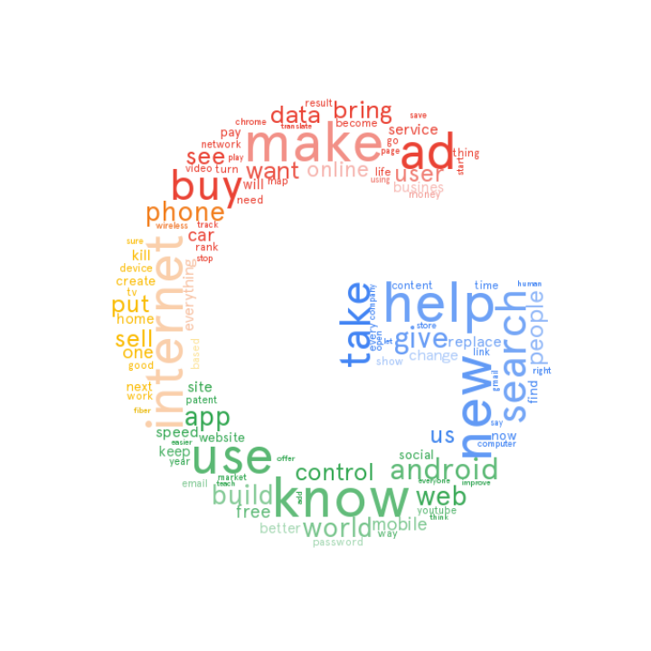

# corporate desires

https://www.bloomberg.com/news/articles/2017-10-19/google-wants-to-train-other-companies-to-use-its-ai-tools

This got me to think: ok, so what else do they want?

I scraped social media posts that contain the string "[corporate name] wants to." Next I will do some data analysis and visualization. Some preliminary word clouds:

